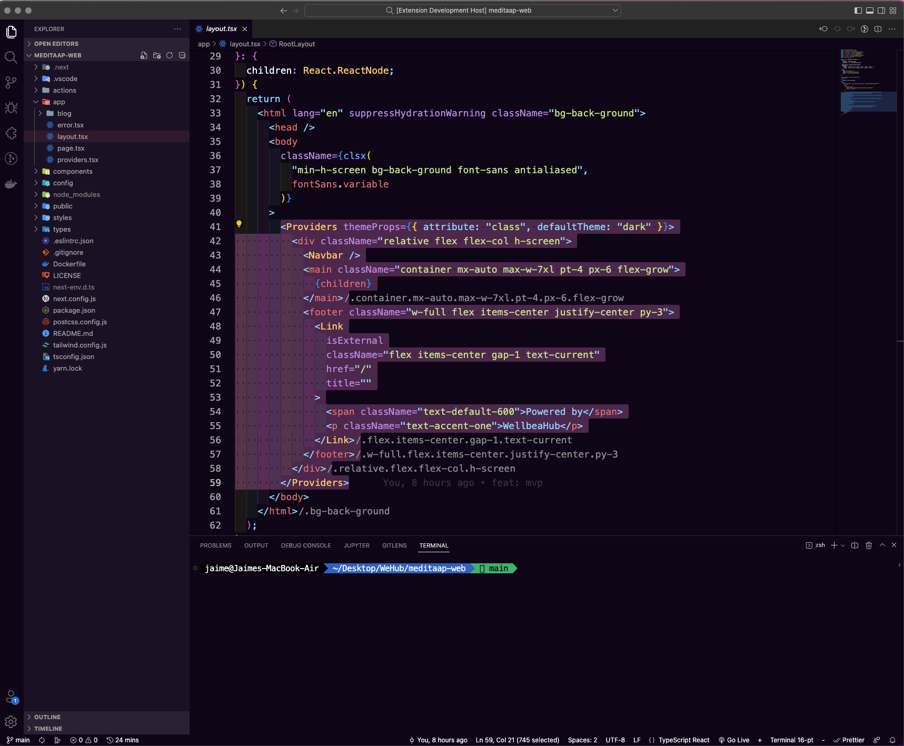

# WellbeaHub Theme for Visual Studio Code

The WellbeaHub theme is designed for Visual Studio Code, providing a coding experience that is pleasant and easy on the eyes, especially during long coding sessions.



## Features

- A carefully chosen dark color palette to reduce eye strain.
- Enhanced syntax highlighting for a wide range of programming languages.
- Balanced contrasts to make reading easier and to quickly locate important elements.

## Installation

To install the WellbeaHub Theme, follow these steps:

1. Open the **Extensions** view in Visual Studio Code. `View → Extensions`.
2. Search for 'WellbeaHub Theme'.
3. Click **Install** to install it.
4. Go to `Code → Preferences → Color Theme` and select "WellbeaHub Theme" from the list.

## Usage

Once installed, you can further personalize the theme through your own settings in `settings.json`. Here's an example of how you can change some settings:

```json
"workbench.colorCustomizations": {
"[WellbeaHub Theme]": {
"sideBar.background": "#0c0517",
// ... (and so on for other customizations)
}
}
```

## Contributions

We are open to suggestions and feedback. If you wish to contribute or have any ideas to improve the theme, feel free to open an [issue](https://github.com/WellbeaHub/WellbeaHub-Theme-VScode) or a pull request on the GitHub repository.

## Changelog

### 1.0.0

- Initial release.
